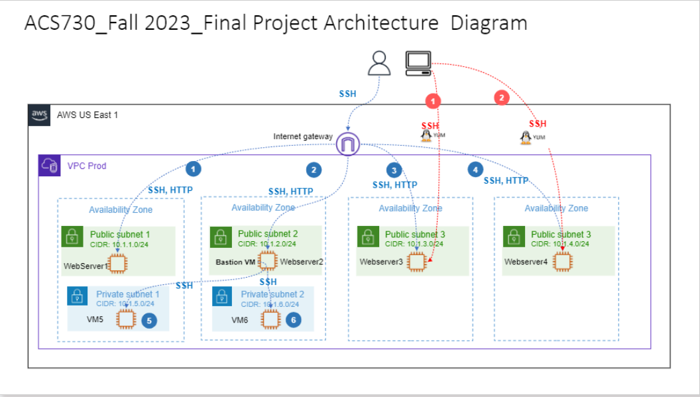
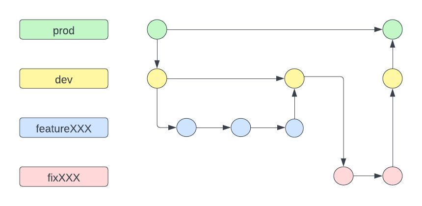
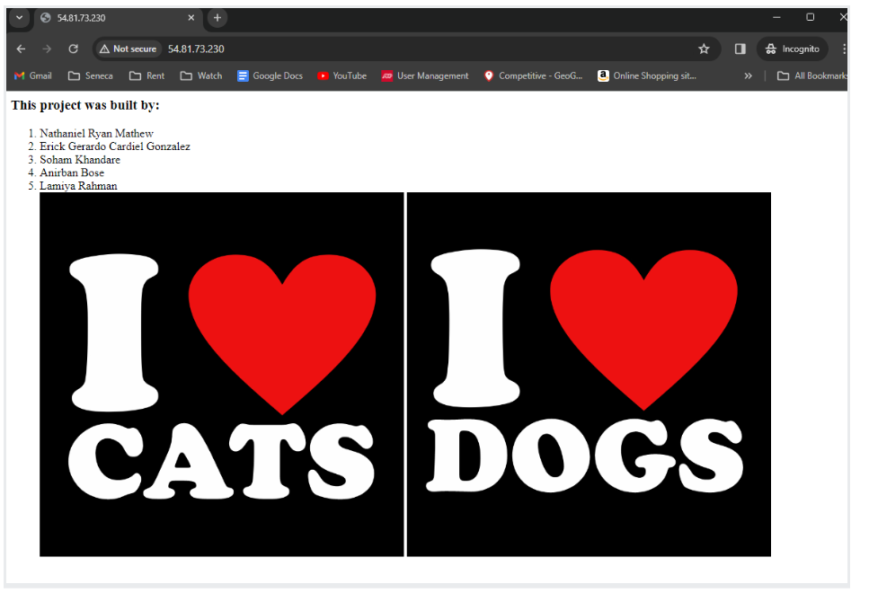

# Cloud Automation and Control Systems (ACS730) - Project

## Traffic Flow
</img>
##### Blue Flow: 
In the blue flow, an external user is able to access the webservers 1,2,3 and 4 via http and ssh hosted in public subnets 1, 2, 3 and 4 through an internet gateway, as well as the VMs 5 and 6 hosted in the private subnets 1 and 2 through a bastion host.
##### Red Flow: 
The red flow represents how Ansible configures webservers 3 and 4 in public subnet 3 and 4.

## Steps to run the project
1. Provision an S3 bucket and add the bucket name to the Terraform/main/config.tf file
2. Run the terraform code to provision resources
````
```
cd  Terraform/main/main.tf 
alias tf=terraform
tf init
tf validate
tf plan
tf apply
```
````
3. Run ansible via the below code to configure the webservers for WebServer 3 and 4
````
```
cd Ansible
ansible-playbook -i aws_ec2.yaml install_httpd.yaml
```
````
## Team Members and GitHub accounts
1. [nathanielmathew](github.com/nathanielmathew) - Nathaniel Ryan Mathew
2. [erickcardiel](github.com/erickcardiel) - Erick Gerardo Gonzalez Cardiel 
3. [abose8seneca](github.com/abose8seneca) - Anirban Bose 
4. [sohamk1997](github.com/sohamk1997) - Soham Kandhare
5. [lamiyarahman](github.com/lamiyarahman) - Lamiya Rahman 

## Branching Strategy: Task Branching
This repository uses task branching since agile centers around user stories, task branches pair well with agile development. Each user story (or bug fix) lives within its own branch, making it easy to see which issues are in progress and which are ready for release
</img>

### Custom 'Type' Tags used:
- TFWebserver: 
Webserver configured using Terraform code.

- AnsibleWebserver: 
Webserver configured using Ansible code.

- TFPrivateVM: 
Virtual machine in private subnet.

### Execution screenshot
</img>


### Conclusion

Thanks to this project, we went deeper into the details of how GitHub Actions/Workflows works and how this CI/CD tool can efficiently help us deliver code. We encountered an issue while using Gitflows, where the Workflows were not being triggered, even though we executed the actions specified in the YAML file. After some reading in the documentation, we realized that, accidentally, when modularizing the Gitflows for linting and security, we left the parameter "path:" for all environments. After removing it, we obtained the desired result and gained a better understanding of the tool. Additionally, while executing our deployment playbook, Ansible was not able to identify any host. We solved this issue when we noticed that while creating the Ansible dynamic inventory file, we did not put the prefix in the host names specified in the aws_ec2.yaml file.
